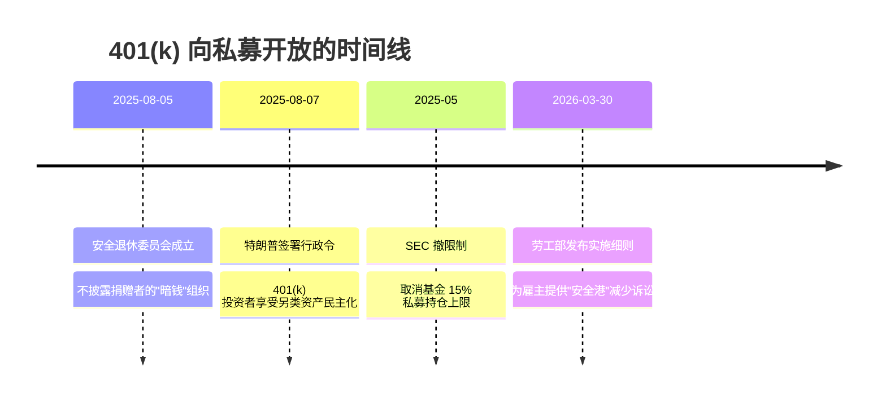

# 私募和AI合体了——OpenAI、Anthropic和黑石

> [!info] 视频信息
> 内部看美国 · 16:57 · 2026-05-08 · [原视频](https://www.bilibili.com/video/BV1fLduBbEP1/)

## 核心观点

OpenAI 与 Anthropic 分别和私募基金合资成立 AI 咨询公司（OpenAI 40 亿、Anthropic 15 亿美元），表面是"投资未来科技"，实际是 **私募既是合资公司股东、又是客户实控人**——买方和卖方是同一拨人。这套结构会通过 AI 咨询费 + AI 股价故事两笔钱同时抽血，最后留下债务走人。而支撑这套游戏的资金池，正在通过特朗普行政令、劳工部新规、SEC 松绑，从 9000 万美国人的 401(k) 退休金里被开出来。

## 私募基金的"病毒"模式

私募基金的本质是金融体系里最像病毒的存在：**不创造价值，寄宿在有稳定现金流的实体上，榨干之后换下一个**。它不经营公司，而是经营公司的资产负债表。

> [!example] 三个标志性案例
> 
> **玩具反斗城（Toys R Us，2005）**
> 贝恩资本、KKR、Vornado 联合收购，66 亿美元里 53 亿是借的债，且债压在被收购方身上。被收购后玩具反斗城每年付 4 亿多美元利息，私募还通过管理费和咨询费抽走数亿。2017 年破产，3.3 万人失业，私募"全身而退"——债是公司欠的，不是私募欠的。
>
> **斯图尔特医疗机构（Steward Health Care，2010）**
> 私募基金 Cerberus 收购后做了 sale-leaseback：把医院的楼、地、设备全卖给一家公司，再让医院租回来用。Cerberus 通过这笔交易加自己开给自己的咨询费抽走约 8 亿美元。2024 年破产时，有的产房没暖气、急诊室缺基本设备、护士几个月没发工资。
>
> **养老院死亡率上升 10%**
> 沃顿商学院 + 芝加哥大学的大样本研究（发表于美国医学会杂志 JAMA），私募收购后的养老院老人死亡率上升约 10%。机制：裁员、压缩耗材和药品，给医保的报价不变，差价就是私募的回报。

## 私募 + AI 为什么"一拍即合"

过去十年私募找到了完美宿主——**软件即服务（SaaS）公司**。订阅制、续费率 90%+、年费可锁定可倒推，账特别好算。Bloomberg 数据：2015–2025 年私募收购了 1900+ 家软件公司，交易总值 4400 亿美元。

| 角色 | 在合资公司中的位置 |
|---|---|
| 私募基金 | 合资公司股东（投钱进去拿股权） |
| 私募被投的软件公司 | 合资公司的"种子客户"（采购 AI 转型服务） |
| OpenAI / Anthropic | 提供 AI 技术的合资伙伴 |

这个结构怎么转：

1. 私募投资金到 AI 咨询合资公司 → 拿股权
2. 私募旗下几百家被投软件公司 → 作为客户去采购合资公司的 AI 转型服务
3. 合资公司有了收入 → 估值推高 → 私募持有的股权账面增值
4. 出资方满意 → 私募募下一支更大的基金

## 双重抽血：左手倒右手

> [!warning] 两笔钱同时进入私募口袋
>
> **第一笔：AI 咨询费**
> 软件公司通过裁员、提价、举新债挤出钱，付给"自己股东开的"AI 合资公司，换来一堆不知道怎么用的 AI 转型方案。钱从软件公司消失，进入合资公司收入——左手倒右手。
>
> **第二笔：AI 股价故事**
> 软件公司"做 AI 转型"本身就是个故事，可以推高股价。私募作为股东再赚一笔。
>
> 剩下的：一地债务 + 被裁掉的软件工程师。AI 转型若看不到回报，债务最终压垮软件公司——届时它已与私募无关，钱已被掏空。

**关键观察**：这种结构不是钻法律空子，而是公开写在交易条款里。"合资公司的种子客户就是私募自己手里的被投企业"——这是设计，不是黑幕。需求量、价格都是私募内部定的。

## 钱从哪来：401(k) 是新燃料

私募的运作本质是庞氏：增长永远需要新的接盘侠。黑石管 1 万亿、阿波罗管 7000 多亿，每轮基金都比上轮大。传统 LP（养老金、大学捐赠基金、主权财富基金、保险公司）的资金扩张跟不上私募膨胀速度。

**于是私募开始往下找钱——美国最大的、还没被充分动用的资金池：401(k)，14 万亿美元，9000+ 万人一辈子攒的退休金。**

> [!quote] 财政部长贝森特
> "这项规则提案是引领川普总统黄金时代的又一步。"

> [!quote] SEC 主席
> "这项转变将让所有投资者都有机会接触到一个日益重要的资产类别。"

### 游说账单（公开数据）

| 实体 | 金额 / 期间 |
|---|---|
| 私募行业 2024 联邦游说 | $4500 万+ |
| 美国投资委员会（行业协会）累计 18 年 | $5900 万，雇 26 家游说公司 |
| 黑石 2023–2024 游说 | $540 万 |
| 黑石 38 位游说者中曾在政府任职 | 32 位 |

## 个人思考

- [ ] 这个结构和"宿主-病毒"的隐喻——同样适用于评估其他金融-科技合资模型吗？AI 应用层创业公司被"打包卖给"私募被投企业，会不会也是同一套？
- [ ] 401(k) 一旦放开私募后，本来"长期低风险"的退休账户底层资产风险升级，但持有人感知不到——这是金融层面的[[concept_competition_力框架]]延伸：监管放开 = 玩家结构变化
- [ ] 视频核心叙事链：私募吸血 → 软件公司是宿主 → AI 是新故事 → 401(k) 是新燃料。这个链条对理解 [[concept_ai系统设计原则]] 之外的"AI 经济学"层很有用——技术之外，泡沫的金融机制才是关键
- [ ] 谷歌 CEO 那句"AI 泡沫破裂没有公司能幸免"——值得追溯原文

## 原始转录

> [!note]- 完整转录（Qwen ASR，约 5400 字）
> 资本主义世界现在最大的两只吸血虫，私募基金和人工智能，现在合体了。就在几天之前呢，Anthropic 成立了一家 AI 咨询合资公司，由黑石领投，像阿波罗、高盛等等十几家公司跟投，一共是十五亿美元。紧接着 OpenAI 也搞了一个规模更大的，四十亿美元，二十来家私募基金扎堆，像贝恩资本、TPG 都在里面。你先不要理解啊，这个是 AI 公司又融到钱了。这两笔交易啊，不是私募基金去买 OpenAI 或者是 Anthropic 的股权，它是私募基金跟 AI 公司的合资成立一个新的咨询实体，帮助企业做 AI 转型，收咨询费。那私募呢，既是股东，也是第一批的客户，一个新型的吸血怪兽啊，就此诞生了。
>
> 想要理解这个问题啊，咱们先要理解私募基金到底是个什么东西。私募基金啊，可以说是金融体系里最像病毒的一种存在，它不创造任何东西，它寄宿在一个有稳定现金流的实体上，然后榨干它，榨干之后呢再换下一个。
>
> 第一个最经典的例子，玩具反斗城（Toys R Us），美国最大的玩具连锁店。2005 年，贝恩资本、KKR 和 Veronis 三家私募基金联合收购了它，一共 66 亿美元。私募自己出了大概 13 亿，剩下的 53 亿全是借的债务，而且这个债务背在了玩具反斗城自己身上。被收购之后，玩具反斗城每年光利息就要付 4 亿多美元。这笔钱如果拿来做电商或者装修店面、提高员工工资，公司可能到今年还活着。但不行，这些现金流要用来还私募基金当初借的债，同时私募还通过管理费和咨询费从公司身上抽走了几亿美元。到了 2017 年，公司撑不住了，申请破产，3.3 万人失业，私募一分钱都没赔——因为收购用的钱大部分都是借的，债是玩具反斗城欠下的，不是私募欠下的。公司死了，债主找公司清算，私募基金全身而退。
>
> 我再讲一个比玩具反斗城还要狠的例子。美国有一家叫赛博勒斯（Cerberus）的私募基金，2010 年收购了一家连锁医疗集团——斯图尔特医疗机构（Steward），马赛诸塞州的社区医院，其中很多是穷人区唯一的医疗资源。赛博勒斯收购之后，把医院的房地产全都卖了——楼、地、设备全卖给一家公司，然后让医院再把这些设备租回来用。卖房地产的钱，根据马赛诸塞州参议员调查的报告，赛博勒斯通过这笔交易和自己给自己开的咨询费抽走了大约 8 亿美元，医院从此背上了天价租金。2024 年斯图尔特申请破产，医院关门时，有的产房没暖气，有的急诊室缺最基本的设备，护士几个月没发工资，病人被从手术台上转移走。赛博勒斯一点事都没有——他是股东，不是债务人，公司破产是债权人的事，私募基金的责任在公司法里是有限的。
>
> 还有一个数据，宾夕法尼亚大学沃顿商学院和芝加哥大学的研究者做过一项大样本研究，发表在美国医学会杂志（JAMA）上。他们发现，私募收购的养老院，住在里面的老人在被收购之后死亡率上升了大约 10%。原因非常简单：私募收购之后首先大规模裁员节省成本，每个护工要管的老人变多了，耗材和药品的支出也下降了，老人摔伤、尿路感染的几率增加。而这些养老院对政府医疗保险的收费并没有减少——给政府的报价不变，只是用了更少的护士、更少的耗材，服务同样数量的老人，中间的差价变成了私募的回报。美国医学会杂志不是一个左派杂志，这是美国最权威的医学期刊。
>
> 三个案例合在一起，模式是一样的：私募把能抽走的都抽走了，代价落到了最弱势的群体身上。这群人的做法就是借别人的钱买下公司，把债务压在公司身上，榨取现金流，然后走人，这个公司就像被病毒入侵的宿主——宿主是死是活跟私募没有任何关系，他不经营这家公司，他经营公司的资产负债表，这就是病毒的逻辑。
>
> 过去十年里，这个病毒找了一个最完美的宿主，就是软件公司——软件即服务，订阅制的。根据彭博社的数据，2015 到 2025 年，私募收购了超过 1900 家软件公司，交易总值是 4400 亿美元以上。为什么私募痴迷于软件公司？和技术没有任何关系——因为软件公司收的是年费，客户一旦用了，换的成本极高，续费率常常在 90% 以上。私募使用的依然是收购、裁员、提价同样的做法。不同的是，软件服务公司的账比较好算，因为年费是锁定的，借多少、还多久、卖什么价，全都能倒推出来。整个游戏的核心不是经营这家公司，不是提高效率，是估值的扩张——私募不是在管理资产，是在维持一个不断膨胀的资产池。
>
> 那它为什么跟 AI 一拍即合了呢？现在人工智能最成熟的领域在哪里？编码领域，软件开发，而最需要编码的恰恰是软件服务公司。私募基金手里攥着 1900 多家软件服务企业，正好是 AI 最擅长替代的那一层。所以 AI 和私募碰在一起不是偶然。私募跟 OpenAI 和 Anthropic 合资成立的这些咨询公司，完全不是什么"投资未来科技"。它是怎么运行的？私募投钱进 AI 咨询合资公司，拿到股权；然后私募现有控制的几百家被投企业，全都作为客户去采购这家合资公司的 AI 转型服务；那合资公司就有了收入，推高了估值，私募持有的股权也就增值了，账面回报变得更好看，出资方就非常满意——私募就可以募下一个更大的基金。
>
> 玩具反斗城、斯图尔特医院，全都是被管理费咨询费抽干的。现在私募手里的软件公司正在被 AI 这根管子再抽一笔。第一笔钱就是咨询费——软件公司通过裁员、提价，还有背上新的债务，挤出来钱付给这家私募自己开的 AI 合资公司，去换一堆根本不知道该怎么用的 AI 转型，钱就从软件公司消失了，进入了合资公司的收入，就是左手倒右手。第二笔就是股价——软件公司做 AI 转型本身就是一个故事，故事可以推高软件公司的股价，私募作为股东再赚一笔。两笔钱都进入了私募的口袋，剩下的就是一地的债务和被裁掉的软件工程师。如果这些 AI 转型迟迟看不到回报，这些债务最终会把软件公司压垮，而软件公司破产的时候，就跟玩具反斗城、斯图尔特医疗一样，已经跟私募基金没有关系了，它的钱已经被掏空了。
>
> 你看到问题了吧？买方和卖方是同一拨人。私募既是合资公司的股东，又是客户的实控人，一手控制供给，一手控制需求。在正常市场里，价格是买方和卖方独立博弈出来的，但在这个交易结构里没有这回事——需求量是私募内部自己定的，价格也是内部定的，收入从私募的左口袋付出去，又流入到了私募的右口袋。收入增长和估值的提升在账面上确实是真实的，但在经济上到底有什么意义呢？这不是在投资，这是在用出资方的钱给自己的资产创造账面增长，这跟当初的互联网公司刷 DAU、电商平台刷单、房地产公司找相关方买自己的房子，本质上是同一个套路，只不过私募这次把规模做得更大，披上了一层 AI 转型的外衣。关键是，这种玩法不是私募在钻法律的空子，它是公开写在交易条款里的——根据美国媒体报道，"合资公司的种子客户就是私募自己手里的被投企业"，这不是需要调查记者去挖的内幕，这就是这个交易设计。
>
> 那你可能要问，私募用来下注的这些钱到底是谁的呢？私募是替别人管钱的行业，它的资金来源业内叫做 LP——养老金、大学的捐赠基金、主权财富基金、保险公司等等。美国的州立公务员退休金、教师工会的养老金、消防员的退休账户，这些钱是私募行业里最大的出资方。
>
> 过去几十年里这个模式一直转得动，但问题是，私募这种运作方式本质上是庞氏骗局——它不创造任何财富，它的增长永远需要新的接盘侠接手。这些年私募在不停变大，黑石管着 1 万亿，阿波罗管着 7000 多亿，每一轮的基金都比上一轮大，LP 的出资（说白了就是老百姓的养老金）必须跟着放大，否则游戏持续不下去。但传统 LP 的资金规模增长是有限的，不可能跟私募基金的膨胀速度同步——这个时候私募就开始往下找钱了。
>
> 什么叫往下找？就是找那些以前被法律挡在外面、现在法律开始松动的钱——也就是普通人的 401(k) 退休账户。**2025 年 8 月 7 日**，特朗普签了一个行政令"让 401(k) 投资者也能享受另类资产的民主化"，核心内容是指示劳工部和 SEC 修改规则，为 401(k) 计划纳入私募基金、私募信贷、加密货币、房地产等另类资产扫清障碍。**2026 年 3 月 30 日**，劳工部正式发布了实施细则提案，为愿意把另类资产放入 401(k) 计划的雇主提供安全港保护、减少他们的诉讼风险。这项改革覆盖超过 9000 万美国人。财政部长贝森特说："这项规则提案是引领川普总统黄金时代的又一步。"
>
> 与此同时，**2025 年 5 月** SEC 撤掉了一条执行多年的内部政策——原来一只基金如果超过 15% 的钱投在私募基金里，就只能卖给合格投资者（有风险承担能力、起投至少 2.5 万美元）。为什么会有这个限制？因为私募基金运作非常不透明、风险非常高，需要专业投资者才能看明白，否则进去就是韭菜。这个限制撤掉之后，普通人就能通过基金间接买到私募了，门槛基本没了。SEC 主席自己说："这项转变将让所有投资者都有机会接触到一个日益重要的资产类别。"
>
> 这些规则不是政府自己凭空想出来的。根据 OpenSecrets 的数据，私募行业在 2024 年联邦游说花费超过 4500 万美元；私募的行业协会美国投资委员会 18 年来累计花了 5900 万，雇了 26 家游说公司，公开的游说议题之一就是把私募资产塞进 401(k)。黑石一家公司 2023 到 2024 的游说支出就是 540 万美元，黑石的 38 位游说者里 32 位曾经在政府任职。
>
> 再看一个时间线：**2025 年 8 月 5 日**，一家叫"安全退休委员会"的组织注册成立，这是一种不用披露捐赠者的暗钱组织。两天之后，**8 月 7 日** 特朗普签了行政令。随后这个委员会就启动了一个百万美元级的广告投放，告诉普通人"另类资产进你的退休账户是对你好"——"Private markets include thousands of businesses across real estate, infrastructure projects and private companies like tech startups, even private credit loans. Historically, investing in these markets was limited to wealthy investors and pensions, but now there's a chance for everyday American savers to opt in for access through their 401k plan if they choose to." 多么"好"的投资机会啊。
>
> 私募基金花这么多钱去游说，目的是什么？真的是为了普通人好吗？这些措辞——"民主化""黄金时代""让所有投资者都有机会"——听起来像给普通人送福利。但如果你把前面我说的这些案例串起来，你应该很清楚：私募不是在送给你机会，私募是在给自己找燃料、给自己找接盘侠。当传统的 LP 增长跟不上私募基金膨胀速度的时候，私募就需要打开一个更大的资金池，而美国最大的还没有被充分动用的资金池就是 401(k)——14 万亿美元，9000 多万人一辈子攒下来的退休金，现在的这些钱将会被拉进美国的 AI 泡沫里面。
>
> 私募基金的这种模式说到底就是击鼓传花，它不产生任何实际的价值，只是寄生，最后一定要找到接盘侠的，这个接盘侠也一定是那些最没有风险承受能力的普通投资者。
>
> 现在可以说是一个群魔乱舞的时代，每个人都想从 AI 泡沫里分一杯羹，让现在这个 AI 泡沫不单是人类历史上最大的金融泡沫，还是一个包罗万象的泡沫，各行各业都牵扯其中。这就让我想起了谷歌 CEO 几个月前说的一句话：**"如果人工智能泡沫破裂，那没有哪家公司能够幸免。"**
>
> 关注我时间长的朋友可能都知道，我对 AI 技术没有任何抵触，我非常看好 AI 技术，认为 AI 将来一定能把人类的生产力推上一个新的高度，我一直鼓励大家使用 AI——但是现在围绕着这个 AI 技术玩的各种金融操作，实在让我非常担心。
